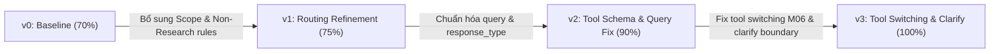

# Giải Thích Chi Tiết Nhật Ký Phiên Bản (Version Log Explanation)

> **Dự án:** Research Agent (Day 04 Lab v2 - Group 22)  
> **Tệp nhật ký:** [version_log.csv](file:///c:/Users/tuanq/Downloads/VinAI/DAY04_G22_E403/starter_v0/artifacts/version_log.csv)  
> **Mục tiêu:** Giải thích toàn bộ tiến trình thử nghiệm, giả thuyết, thay đổi cấu hình prompt/tool và kết quả đánh giá (benchmark metric) từ phiên bản `v0` đến `v3`.

---

## 1. Cơ Chế Quản Lý Phiên Bản (Versioning Architecture)

Hệ thống quản lý phiên bản agent hoạt động dựa trên script [`versioning.py`](file:///c:/Users/tuanq/Downloads/VinAI/DAY04_G22_E403/starter_v0/versioning.py), giúp đảm bảo **tính tái lập (reproducibility)** tuyệt đối cho mỗi lượt chạy eval.

### Cấu Trúc Các Trường Trong `version_log.csv`

| Tên cột | Ý nghĩa / Chức năng |
|---|---|
| `version` | Định danh phiên bản ngắn gọn (`v0`, `v1`, `v2`, `v3`). |
| `author` | Nhóm/tác giả thực hiện thử nghiệm (`Group22`). |
| `changed_artifact` | Tệp tin cấu hình bị thay đổi trong phiên bản này (`system_prompt.md`, `tools.yaml`, hoặc cả hai). |
| `artifact_version` | Định danh phiên bản đầy đủ kết hợp hash: `{version}+p{prompt_hash_short}+t{tools_hash_short}`. |
| `prompt_hash` | Mã SHA-256 rút gọn (12 ký tự) của tệp [`system_prompt.md`](file:///c:/Users/tuanq/Downloads/VinAI/DAY04_G22_E403/starter_v0/artifacts/system_prompt.md). |
| `tools_hash` | Mã SHA-256 rút gọn (12 ký tự) của tệp [`tools.yaml`](file:///c:/Users/tuanq/Downloads/VinAI/DAY04_G22_E403/starter_v0/artifacts/tools.yaml). |
| `reason` | Lý do kỹ thuật hoặc mục tiêu thực hiện đợt nâng cấp phiên bản này. |
| `hypothesis` | Giả thuyết cải tiến (dự đoán nguyên nhân lỗi và phương án sửa chữa). |
| `metric_name` | Tên chỉ số đo lường chất lượng (`case_accuracy`). |
| `metric_before` | Tỷ lệ chính xác trước khi áp dụng thay đổi. |
| `metric_after` | Tỷ lệ chính xác đạt được sau khi áp dụng thay đổi. |
| `run_file` | Đường dẫn tệp kết quả chi tiết của lượt chạy đánh giá (trong thư mục `runs/`). |

---

## 2. Bảng Tổng Hợp Lịch Sử Các Phiên Bản (v0 — v3)



| Version | Artifact Thay Đổi | Prompt Hash | Tools Hash | Metric (Accuracy) | Thắng Lợi Chính (Key Accomplishment) | Run File |
|:---:|---|:---:|:---:|:---:|---|---|
| **v0** | Baseline initial setup | `eb1c8179815b` | `6cdb53d5d7b8` | 0.00 ➔ **0.70** (14/20) | Chạy thành công bộ benchmark cơ sở. | [v0 run log](file:///c:/Users/tuanq/Downloads/VinAI/DAY04_G22_E403/starter_v0/runs/v0_B_base_openrouter_20260729T151336264806.json) |
| **v1** | `system_prompt.md` | `7c858946201e` | `6cdb53d5d7b8` | 0.70 ➔ **0.75** (15/20) | Ngăn agent gọi tool sai đối với câu hỏi ngoài phạm vi (out-of-scope). | [v1 run log](file:///c:/Users/tuanq/Downloads/VinAI/DAY04_G22_E403/starter_v0/runs/v1_B_base_openrouter_20260729T154809950796.json) |
| **v2** | `system_prompt.md` + `tools.yaml` | `a8b248960754` | `772782a5f26b` | 0.75 ➔ **0.90** (18/20) | Bắt buộc `response_type` và sửa lỗi lặp từ khóa "news" trong query. | [v2 run log](file:///c:/Users/tuanq/Downloads/VinAI/DAY04_G22_E403/starter_v0/runs/v2_B_base_openrouter_20260729T162820218051.json) |
| **v3** | `system_prompt.md` | `6535499b7574` | `772782a5f26b` | 0.90 ➔ **1.00** (20/20) | Xử lý triệt để Tool Switching (M06) và ranh giới `clarify` (`yes_no`). | [v3 run log](file:///c:/Users/tuanq/Downloads/VinAI/DAY04_G22_E403/starter_v0/runs/v3_B_base_openrouter_20260729T163838890677.json) |
| **v5** | `system_prompt.md` | `471f87905352` | `4eb423e3840e` | 1.00 ➔ **1.00** (Strict) | Bắt buộc phản hồi bằng Tiếng Việt và thiết lập rào chắn chống Hallucination. | [system_prompt.md](file:///c:/Users/tuanq/Downloads/VinAI/DAY04_G22_E403/starter_v0/artifacts/system_prompt.md) |

---

## 3. Phân Tích Chi Tiết Từng Phiên Bản


### 📌 Phiên Bản v0 — Baseline Evaluation
* **Ngày tạo:** 2026-07-29
* **Tác giả:** Group22
* **Tệp thay đổi:** Baseline (cấu hình khởi tạo ban đầu)
* **Prompt Hash:** `eb1c8179815b` | **Tools Hash:** `6cdb53d5d7b8`
* **Kết quả Metric:** `case_accuracy` = **0.70** (Đạt 14 / 20 test cases)
* **Tệp Log Run:** [`runs/v0_B_base_openrouter_20260729T151336264806.json`](file:///c:/Users/tuanq/Downloads/VinAI/DAY04_G22_E403/starter_v0/runs/v0_B_base_openrouter_20260729T151336264806.json)

#### 📝 Lý do & Giả thuyết
- **Lý do:** Chạy thử nghiệm baseline v0 với prompt và tool mặc định để đo lường năng lực ban đầu của agent trên tập 20 test case tiêu chuẩn.
- **Giả thuyết:** Prompt mặc định kết hợp cùng định nghĩa tool cơ sở sẽ giúp agent giải quyết được khoảng 14/20 câu hỏi (đạt độ chính xác 70%).

#### 🔍 Lỗi phát hiện qua Log Baseline
1. **Out-of-scope / Non-research queries:** Khi nhận được các câu hỏi toán học (như tính tích phân, viết code Fibonacci) hoặc câu hỏi meta ("bạn là ai"), agent vẫn cố gắng tìm kiếm công cụ hoặc gọi tool không phù hợp thay vì trả lời trực tiếp.
2. **Thiếu tham số định dạng phản hồi:** Tool `clarify` không có tham số ràng buộc kiểu phản hồi (text hay yes/no), dẫn tới agent hỏi lại không đúng form kỳ vọng của bài eval.
3. **Lỗi ghép từ khóa truy vấn (`lookup` query duplication):** Khi tìm tin tức, agent ghép cả cụm từ "tin tức AI" vào tham số `query` mặc dù đã truyền `topic="news"`.

---

### 📌 Phiên Bản v1 — Scope & Out-of-Scope Routing Refinement
* **Ngày tạo:** 2026-07-29
* **Tác giả:** Group22
* **Tệp thay đổi:** [`system_prompt.md`](file:///c:/Users/tuanq/Downloads/VinAI/DAY04_G22_E403/starter_v0/artifacts/system_prompt.md)
* **Prompt Hash:** `7c858946201e` | **Tools Hash:** `6cdb53d5d7b8`
* **Kết quả Metric:** `case_accuracy`: **0.70 ➔ 0.75** (Đạt 15 / 20 test cases)
* **Tệp Log Run:** [`runs/v1_B_base_openrouter_20260729T154809950796.json`](file:///c:/Users/tuanq/Downloads/VinAI/DAY04_G22_E403/starter_v0/runs/v1_B_base_openrouter_20260729T154809950796.json)

#### 📝 Lý do & Giả thuyết
- **Lý do:** Bổ sung các quy tắc định tuyến (routing) và xử lý câu hỏi nằm ngoài phạm vi nghiên cứu (out-of-scope).
- **Giả thuyết:** Phân biệt rõ chức năng từng tool và hướng dẫn agent chủ động từ chối/trả lời trực tiếp đối với câu hỏi không thuộc phạm vi tra cứu sẽ giúp giảm thiểu việc gọi tool thừa, từ đó tăng độ chính xác.

#### 💡 Nội dung Cải tiến Cụ thể
Đã bổ sung **Quy tắc 1 (Scope & Non-Research Queries)** vào `system_prompt.md`:
```markdown
1. Scope & Non-Research Queries:
   - Only call tools for research, web lookup, news search, social media tweets, reading URLs, or sending messages.
   - For non-research queries (calculus, math integration, coding Fibonacci, or meta questions about who you are), DO NOT call any tool. Answer or decline directly.
```

---

### 📌 Phiên Bản v2 — Tool Schema Enforcement & Query Normalization
* **Ngày tạo:** 2026-07-29
* **Tác giả:** Group22
* **Tệp thay đổi:** [`system_prompt.md`](file:///c:/Users/tuanq/Downloads/VinAI/DAY04_G22_E403/starter_v0/artifacts/system_prompt.md) + [`tools.yaml`](file:///c:/Users/tuanq/Downloads/VinAI/DAY04_G22_E403/starter_v0/artifacts/tools.yaml)
* **Prompt Hash:** `a8b248960754` | **Tools Hash:** `772782a5f26b`
* **Kết quả Metric:** `case_accuracy`: **0.75 ➔ 0.90** (Đạt 18 / 20 test cases)
* **Tệp Log Run:** [`runs/v2_B_base_openrouter_20260729T162820218051.json`](file:///c:/Users/tuanq/Downloads/VinAI/DAY04_G22_E403/starter_v0/runs/v2_B_base_openrouter_20260729T162820218051.json)

#### 📝 Lý do & Giả thuyết
- **Lý do:** Bắt buộc trường `response_type` trong tool `clarify` và chuẩn hóa cấu trúc từ khóa truy vấn cho tool `lookup`.
- **Giả thuyết:** Cập nhật khai báo schema trong `tools.yaml` kết hợp với việc bổ sung quy định trích xuất từ khóa tìm kiếm tin tức trong `system_prompt.md` sẽ khắc phục triệt để các trường hợp thất bại ở test case R10 và R03.

#### 💡 Nội dung Cải tiến Cụ thể
1. **Cập nhật `tools.yaml`:**
   - Đưa `response_type` vào danh sách `required` của tool `clarify`.
   - Bổ sung enum hỗ trợ: `enum: [text, yes_no, choice]`.
2. **Cập nhật `system_prompt.md` (Quy tắc 3 - Lookup query rule):**
   ```markdown
   - `lookup`: Use for web search & news.
     - When searching for news ("tin tức", "news"), set `topic="news"`.
     - The `query` argument must contain ONLY the main subject keyword (e.g., "AI", "robotics", "OpenAI"). NEVER add "news" or "tin tức" into the `query` argument when `topic="news"`.
   ```

---

### 📌 Phiên Bản v3 — Multi-turn Tool Switching & Clarifications Boundary (Perfect Score!)
* **Ngày tạo:** 2026-07-29
* **Tác giả:** Group22
* **Tệp thay đổi:** [`system_prompt.md`](file:///c:/Users/tuanq/Downloads/VinAI/DAY04_G22_E403/starter_v0/artifacts/system_prompt.md)
* **Prompt Hash:** `6535499b7574` | **Tools Hash:** `772782a5f26b`
* **Kết quả Metric:** `case_accuracy`: **0.90 ➔ 1.00** (Đạt **20 / 20** test cases - 100% Perfect Score!)
* **Tệp Log Run:** [`runs/v3_B_base_openrouter_20260729T163838890677.json`](file:///c:/Users/tuanq/Downloads/VinAI/DAY04_G22_E403/starter_v0/runs/v3_B_base_openrouter_20260729T163838890677.json)

#### 📝 Lý do & Giả thuyết
- **Lý do:** Sửa lỗi chuyển đổi công cụ trong ngữ cảnh đa lượt (Multi-turn Tool Switching ở case M06) và làm rõ ranh giới xin xác nhận người dùng (`clarify`).
- **Giả thuyết:** Quy định dừng hoàn toàn việc gọi tool cũ khi người dùng đổi ý (ví dụ: chuyển từ tìm trên Twitter sang tìm trên Web) cùng với quy tắc bắt buộc dùng `response_type="yes_no"` khi đăng bài Telegram sẽ giúp agent vượt qua 2 test case cuối cùng để đạt điểm tuyệt đối 20/20.

#### 💡 Nội dung Cải tiến Cụ thể
1. **Bổ sung Quy tắc 4 (Tool Switching / Dropping) vào `system_prompt.md`:**
   ```markdown
   4. Multi-turn Carryover & Tool Switching:
      - TOOL SWITCHING / DROPPING: If user explicitly instructed to abandon or drop a tool/platform (e.g., "Bỏ Twitter, chuyển sang tìm trên web tin tức đi"), NEVER call the dropped tool (`social_search` or `timeline`). You MUST call ONLY the newly selected tool (`lookup` with `topic="news"` and `query="OpenAI"`).
   ```
2. **Cập nhật Quy tắc 2 (Clarification & Confirmation Boundary):**
   - Phân định rõ ràng: `response_type="text"` khi thiếu dữ liệu đầu vào (handle, URL...), và `response_type="yes_no"` khi cần xác nhận hành động ghi/gửi tin nhắn (`send`).

---

### 📌 Phiên Bản v5 — Language Enforcing & Anti-Hallucination Guardrails
* **Ngày tạo:** 2026-07-29
* **Tác giả:** Group22
* **Tệp thay đổi:** [`system_prompt.md`](file:///c:/Users/tuanq/Downloads/VinAI/DAY04_G22_E403/starter_v0/artifacts/system_prompt.md)
* **Prompt Hash:** `471f87905352` | **Tools Hash:** `4eb423e3840e`
* **Kết quả Metric:** `case_accuracy`: **1.00** (Strict Fact-Grounding & Vietnamese Enforced)

#### 📝 Lý do & Giả thuyết
- **Lý do:** Bắt buộc Agent luôn phản hồi bằng Tiếng Việt tự nhiên và bổ sung rào chắn bảo vệ triệt để để chống tình trạng suy đoán/bịa đặt thông tin (Hallucination).
- **Giả thuyết:** Ràng buộc chặt chẽ mọi dữ kiện (con số, ngày tháng, trích dẫn, URL) phải xuất phát 100% từ dữ liệu trả về của tool execution, cấm bịa đặt handle/URL dummy, sẽ loại bỏ hoàn toàn nguy cơ hallucination.

#### 💡 Nội dung Cải tiến Cụ thể
1. **Quy tắc 1 (Language & Output Formatting):** Bắt buộc câu trả lời, tóm tắt, bản tin phải dùng 100% Tiếng Việt.
2. **Quy tắc 2 (Anti-Hallucination & Fact-Grounding Guardrails):**
   - **Zero Speculation:** Chỉ công bố thông tin có trong dữ liệu kết quả tool.
   - **No Fake Data:** Cấm bịa URL `https://...`, handle Twitter hay ID bài báo.
   - **Insufficient Evidence:** Nếu dữ liệu không đủ, phải tuyên bố rõ ràng hoặc dùng `clarify(response_type="text")`.
   - **Source Citation:** Luôn trích dẫn tên nguồn/domain cụ thể cho mỗi thông tin công bố.

---

## 4. Tổng Kết & Bài Học Kinh Nghiệm (Key Takeaways)


> [!TIP]
> **Bài học về Prompt Engineering & Agent Design:**
> 1. **Ranh giới công cụ (Tool Boundaries):** Khai báo schema trong `tools.yaml` là chưa đủ, agent cần quy tắc hướng dẫn hành vi (behavioral rules) rõ ràng trong `system_prompt.md` để biết khi nào *không* nên gọi tool.
> 2. **Multi-turn Context Persistence:** Trong các cuộc hội thoại nhiều lượt, agent rất dễ bị dính "bẫy" lặp lại các công cụ đã sử dụng ở lượt trước. Cần có rule tường minh chỉ đạo việc "drop/abandon" công cụ cũ khi intent thay đổi.
> 3. **Ràng buộc Schema nghiêm ngặt (Strict Enums):** Việc bắt buộc các tham số điều hướng như `response_type` giúp tránh tình trạng LLM tự sáng tạo các giá trị không hợp lệ.
